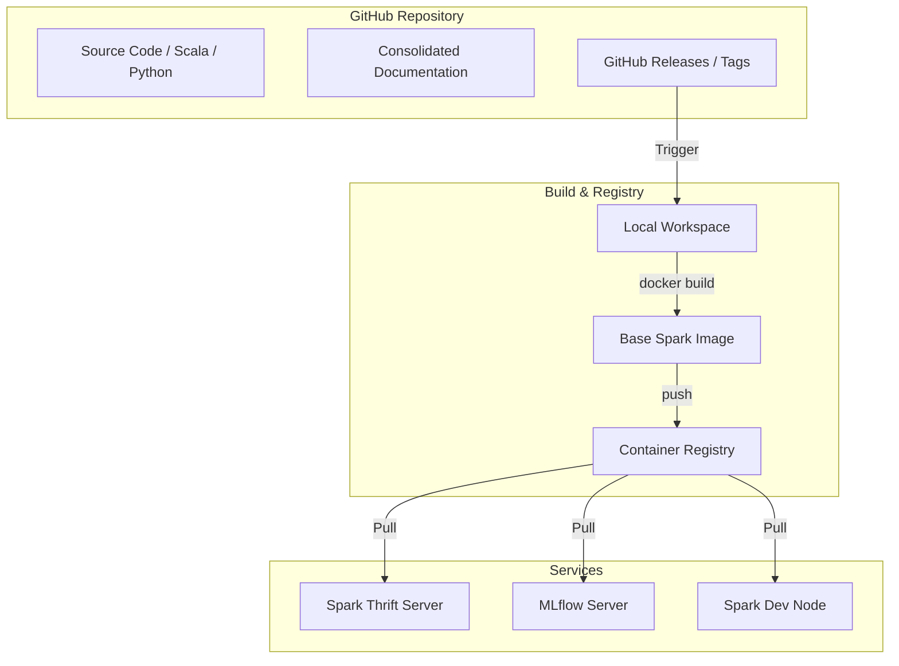

# Rusha Spark 3.5.8 Base

This repository contains the infrastructure and code for the **Rusha Spark 3.5.8 Base**, a unified Spark environment designed for production SQL interfaces, machine learning experimentation, and interactive development.

## 1. Project Overview

The core of this project is a **Base Spark Image** (`rusha-spark-3.5.8-base`) that serves as the foundation for multiple Spark-based services. This repository is specifically focused on supporting various Spark services like the **Thrift Server**.

It includes native support for:
- **Nessie**: Git-like versioning for Data Lakes.
- **Apache Iceberg**: High-performance table format.
- **Delta Lake**: Reliable data lakes with ACID transactions.
- **Unity Catalog**: Unified governance for data and AI.
- **Hive**: Metadata management and SQL interface.
- **AWS Integration**: Full S3 and AWS SDK support.
- **Hadoop Native Decompressors**: Robust support for concatenated (multi-member) GZIP files using Hadoop 3.3.6.

### Architecture Visualization



## 2. Getting Started

### Prerequisites
- Docker & Docker Buildx
- Java 17 & SBT (for building Scala components)
- Python 3.12 & Poetry

### Environment Variables
The following variables are required for various services. It is recommended to manage them via a `.env` file (ignored by git).

| Variable | Description | Default |
|----------|-------------|---------|
| `SPARK_MASTER` | URL of the Spark master | - |
| `SPARK_WAREHOUSE_DIR` | Directory for Spark warehouse | - |
| `METASTORE_URIS` | URIs for the Hive metastore | - |
| `DOCKER_REGISTRY` | (Optional) Destination container registry | - |
| `DOCKER_REPO` | (Optional) Destination repository name | `rusha-spark-3.5.3-base` |

## 3. Build & Release Process

### Local Build
To build the base image locally:
```bash
./local/build.sh
```
By default, this will build and tag the image locally. To push to a remote registry, set the `DOCKER_REGISTRY` environment variable in your `.env` file.

### Internal Build Workflow (Rusha Corp. Developers)
For security in this public repository, internal registry pushes are performed locally via `make` using your host credentials. This serves as our local "pipeline".

1. **Configure Environment**: Ensure your local `.env` file contains the internal `DOCKER_REGISTRY`, `DOCKER_REPO`, and `AWS_REGION`.
2. **Build & Push**:
   ```bash
   make push
   ```
3. **Formal Release**:
   This project uses semantic versioning. Releasing will automatically update `pyproject.toml`, push to GitHub, create a GitHub Release, and push the versioned image to the internal registry.
   ```bash
   make patch   # Increment v0.1.0 -> v0.1.1
   make minor   # Increment v0.1.0 -> v0.2.0
   make major   # Increment v0.1.0 -> v1.0.0
   # OR use an explicit version
   make release VERSION=v1.2.3
   ```
This workflow ensures that internal registry details and credentials are never exposed in GitHub Actions or public CI/CD logs.

### Releases
Proper releases are managed via Git tags. Creating a tag will trigger a versioned build.
```bash
./scripts/release.sh v1.0.0
```

## 4. Service Details

### Spark Thrift Server
Starts the Hive Thrift Server 2 on Kubernetes or locally.
- **Usage**: `./start_thrift_server_k8s.sh` or via Docker Compose.
- **Port**: 10000

### MLflow
Manages machine learning lifecycles.
- **URL**: `http://localhost:5000`

### Iceberg REST
Provides a REST interface for Apache Iceberg catalogs.
- **URL**: `http://localhost:8181`

## 5. Security & Development
- **No Secrets**: Never commit secrets or `.env` files. Audit history regularly.
- **Local Context**: Always build from the local workspace to ensure uncommitted changes are tested.
- **Dependencies**: Scala dependencies are managed via `build.sbt` and Python via `pyproject.toml`.

---
*Maintained by Rusha Corp.*
